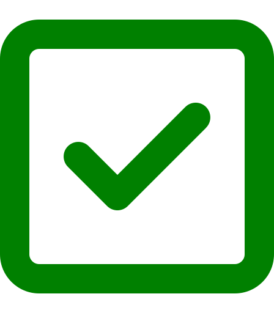

  
  <h1 align="center">Simple Todo List</h1>
  

  This is a simple todo list app using Vanilla Javascript.
  

## About The Project

[![Todo LIst][product-screenshot]](https://bunokent.github.io/todo-list/)

I built this simple web application using HTML, CSS and Javascript. It allows user to create and delete tasks on a to-do list. Additionally, users can mark tasks as complete.

### Built With

- [HTML](https://developer.mozilla.org/en-US/docs/Web/HTML)
- [CSS](https://developer.mozilla.org/en-US/docs/Web/CSS)
- [Javascript](https://developer.mozilla.org/en-US/docs/Web/JavaScript)

## Contact

- Facebook: [Kent Buno](https://www.facebook.com/kent.buno)
- Github: [Github](https://github.com/bunokent)
- Project Link: [Todo List](https://bunokent.github.io/todo-list/)

## Acknowledgments

Here are some of the resources that I used in building this project:

- [HTML](https://developer.mozilla.org/en-US/docs/Web/HTML)
- [CSS](https://developer.mozilla.org/en-US/docs/Web/CSS)
- [Javascript](https://developer.mozilla.org/en-US/docs/Web/JavaScript)
- [Font Awesome](https://fontawesome.com/)
- [Custom Checkbox Tutorial](https://www.youtube.com/watch?v=YyLzwR-iXtI&t=668s)

[product-screenshot]: ./images/screenshot.png
